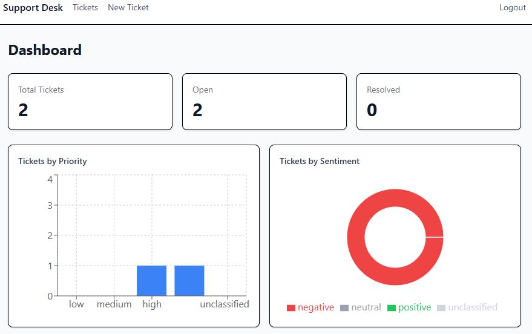
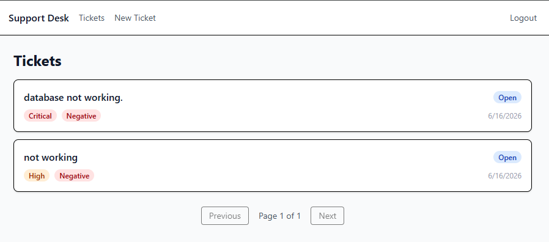
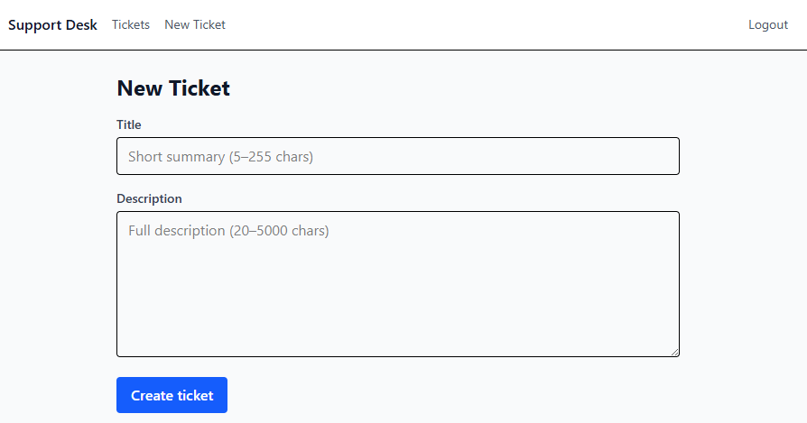
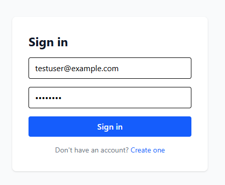
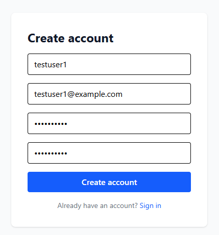
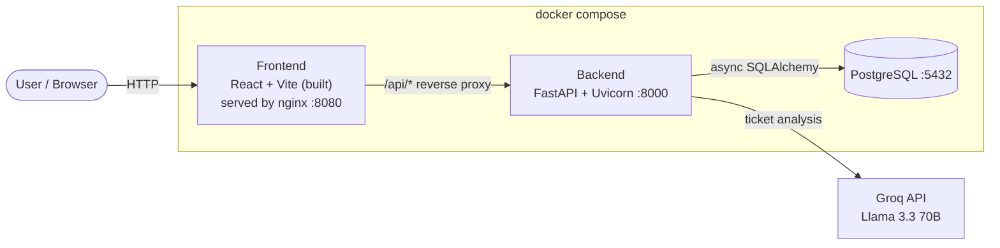

# AI Support Intelligence Platform

A full-stack support-ticket platform that uses an LLM to automatically **summarize**, **prioritize**, and **sentiment-score** every ticket the moment it is created — then surfaces the results in an analytics dashboard.

Built with a **FastAPI** async backend, a **React + TypeScript** frontend, **PostgreSQL**, and **Groq** (Llama 3.3 70B) for the AI layer. The whole stack runs with a single `docker compose up`.

### 🔗 [**Live Demo →**](https://support-frontend-idbm.onrender.com)

> ⏳ Hosted on Render's free tier — the backend sleeps after ~15 min of inactivity, so the **first request may take ~50 seconds** to wake up. Subsequent requests are fast. Register a new account to try it out.

> **Status:** MVP complete and production-hardened — JWT auth with refresh tokens, rate limiting, database migrations, an automated test suite, and a fully containerized deployment.

---

## ✨ Features

- **🎫 Ticket management** — create, list (paginated), view, update, and delete support tickets.
- **🤖 AI enrichment** — on creation, each ticket is automatically analyzed by an LLM to produce:
  - a one-line **summary**
  - a **priority** (`low` / `medium` / `high` / `critical`)
  - a **sentiment** (`positive` / `neutral` / `negative`)
  - *Graceful degradation:* if the AI provider is unavailable, the ticket is still saved (AI fields stay empty).
- **📊 Analytics dashboard** — totals plus breakdowns by priority and sentiment, scoped per user.
- **🔐 Authentication** — JWT access + refresh tokens, bcrypt password hashing, refresh-token rotation.
- **🛡️ Security hardening** — owner-scoped data access (IDOR-safe `404`s), rate-limited auth endpoints, sanitized error responses.
- **✅ Tested** — 18 backend tests covering auth, ticket ownership, CRUD, and analytics.

---

## 📸 Screenshots

### Analytics dashboard
Per-user totals plus priority and sentiment breakdowns, rendered with Recharts.



### Ticket list with AI analysis
Each ticket shows its AI-assigned **priority** and **sentiment** the moment it is created.



<details>
<summary>More screenshots — create ticket, login, register</summary>

**Create a ticket**



**Sign in**



**Create an account**



</details>

---

## 🏗️ Architecture



**Request flow:** the browser talks only to nginx (`:8080`). nginx serves the static React bundle and reverse-proxies `/api/*` to the FastAPI backend, so the frontend and API share an origin (no CORS in production). The backend persists data in PostgreSQL and calls Groq to enrich tickets.

---

## 🧰 Tech stack

| Layer | Technologies |
|---|---|
| **Frontend** | React 19, TypeScript, Vite 8, Tailwind CSS v4, React Router 7, TanStack Query 5, Zustand 5, Axios, Recharts |
| **Backend** | FastAPI, async SQLAlchemy 2.0 (asyncpg), Pydantic v2, python-jose (JWT), passlib + bcrypt, slowapi (rate limiting) |
| **AI** | Groq — `llama-3.3-70b-versatile` via the OpenAI-compatible client |
| **Database** | PostgreSQL, Alembic migrations |
| **Infra** | Docker, Docker Compose, nginx |
| **Testing** | pytest, pytest-asyncio, httpx |

---

## 🚀 Quickstart (Docker — recommended)

**Prerequisites:** [Docker Desktop](https://www.docker.com/products/docker-desktop/) and a free [Groq API key](https://console.groq.com/keys).

```bash
# 1. Clone
git clone https://github.com/mathivetri/ai-support-intelligence-platform.git
cd ai-support-intelligence-platform

# 2. Create your .env from the template, then fill in GROQ_API_KEY + SECRET_KEY
cp .env.example .env

# 3. Build and run the whole stack
docker compose up --build
```

Then open:

- **App:** http://localhost:8080
- **API docs (Swagger):** http://localhost:8001/docs

Migrations run automatically on startup (`alembic upgrade head`). Stop the stack with `docker compose down` (add `-v` to also drop the database volume).

> **Note:** the backend's *published* host port is `8001` (the container still listens on `8000` internally). This avoids a clash on machines where host port `8000` is already in use.

---

## 🛠️ Local development (without Docker)

<details>
<summary>Backend</summary>

```bash
python -m venv venv
venv\Scripts\activate          # Windows  (use: source venv/bin/activate on macOS/Linux)
pip install -r requirements.txt

cd backend
alembic upgrade head           # create the schema
uvicorn app.main:app --reload  # http://localhost:8000
```

Requires a running PostgreSQL instance; point `DATABASE_URL` in `.env` at it.
</details>

<details>
<summary>Frontend</summary>

```bash
cd frontend
npm install
npm run dev                    # http://localhost:5173
```
</details>

---

## 🧪 Tests

```bash
cd backend
pytest -v
```

The suite uses an isolated `<db>_test` database, rolls back after each test, mocks the Groq call (no network), and disables rate limiting. **18 tests** cover authentication, ticket ownership / IDOR, CRUD, and analytics.

---

## 📡 API overview

All endpoints are versioned under `/api/v1`. Full interactive docs at `/docs`.

| Method | Endpoint | Description |
|---|---|---|
| `POST` | `/auth/register` | Create an account → token pair |
| `POST` | `/auth/login` | Log in → token pair |
| `POST` | `/auth/refresh` | Exchange a refresh token for a new pair |
| `POST` | `/tickets/` | Create a ticket (triggers AI enrichment) |
| `GET` | `/tickets/` | List the current user's tickets (paginated) |
| `GET` | `/tickets/{id}` | Get one ticket |
| `PATCH` | `/tickets/{id}` | Update a ticket |
| `DELETE` | `/tickets/{id}` | Delete a ticket |
| `GET` | `/analytics/overview` | Totals + priority/sentiment breakdowns |
| `GET` | `/analytics/sentiment` | Ticket counts by sentiment |
| `GET` | `/analytics/priorities` | Ticket counts by priority |
| `GET` | `/health` | Liveness check |

---

## ⚙️ Configuration

All configuration is via environment variables — see [`.env.example`](.env.example) for the full list with descriptions. Key variables:

| Variable | Description |
|---|---|
| `DATABASE_URL` | Async PostgreSQL URL (`postgresql+asyncpg://...`) |
| `SECRET_KEY` | JWT signing secret — generate with `python -c "import secrets; print(secrets.token_hex(32))"` |
| `GROQ_API_KEY` | Your Groq API key |
| `ALLOWED_ORIGINS` | Comma-separated CORS origins |

---

## 📂 Project structure

```
.
├── backend/
│   ├── app/
│   │   ├── api/v1/        # route handlers (auth, tickets, analytics)
│   │   ├── core/          # config, security (JWT), dependencies, rate limiter
│   │   ├── db/            # async engine + session
│   │   ├── models/        # SQLAlchemy models
│   │   ├── schemas/       # Pydantic schemas
│   │   └── services/      # business logic + AI enrichment
│   ├── alembic/           # database migrations
│   ├── tests/             # pytest suite
│   └── Dockerfile
├── frontend/
│   ├── src/
│   │   ├── pages/         # Login, Register, Dashboard, Tickets, ...
│   │   ├── components/    # layout, charts, UI primitives
│   │   ├── services/      # Axios API client + typed services
│   │   ├── hooks/         # TanStack Query hooks
│   │   └── store/         # Zustand auth store
│   ├── nginx.conf
│   └── Dockerfile
├── docker-compose.yml
└── .env.example
```

---

## 📝 License

[MIT](LICENSE) © 2026 Vetrivelan K
